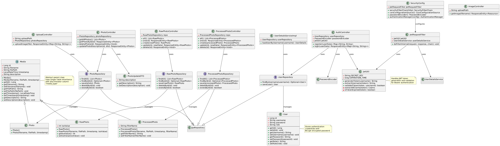
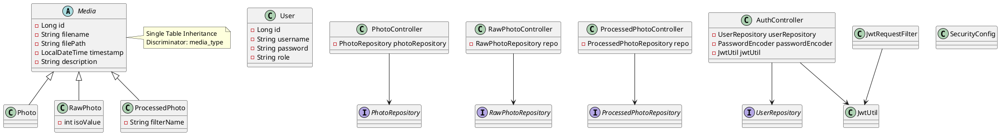

# Bridging IoT with Spring Boot, JPA, NySQL & React

## Description
REST API that receives photos from an ESP32-CAM, stores them in MySQL, and exposes a React dashboard for viewing, editing and deleting images.

## Class Diagram

View PlantUML Source Code

**Architecture Overview:**
- **Inheritance Strategy**: Single Table Inheritance (all Media types in one table with discriminator column)
- **Parent Class**: Media (abstract) - shared attributes for all media types
- **Child Classes**: Photo, RawPhoto (with isoValue), ProcessedPhoto (with filterName)
- **Authentication**: JWT Bearer token authentication with Spring Security
- **Persistence**: JPA repositories for each entity type

For the full detailed UML diagram source file, see [class-diagram.puml](class-diagram.puml)

## Setup
1. Clone the repo  
2. Create MySQL schema `esp32cam` (see `schema.sql`)  
3. `./mvnw spring-boot:run` (port 8080)  
4. `cd frontend && npm install && npm run dev` (port 5173)

## Technologies
- Java 17 & Spring Boot 3
- Spring Security + JWT
- JPA / Hibernate
- MySQL 8
- React 18 + Vite
- Axios

## Package Overview:

| **File Path**                                             | **Category**                   | **Description**                                                                                                |
| --------------------------------------------------------- | ------------------------------ | -------------------------------------------------------------------------------------------------------------- |
| `src/main/java/com/example/esp32cam_server/Esp32cam.java` | **Application Entry Point** | Boots the Spring Boot application and initializes all components.                                              |
| `config/WebConfig.java`                                   | **Configuration**           | Defines global CORS settings to allow communication between React frontend (`localhost:5173`) and backend API. |

 
 

## Security Layer
| **File**                               | **Category**       | **Description**                                                                                                                  |
| -------------------------------------- | ------------------ | -------------------------------------------------------------------------------------------------------------------------------- |
| `security/SecurityConfig.java`         | Security Config | Configures Spring Security — disables CSRF, sets stateless JWT authentication, defines open routes, CORS, and password encoding. |
| `security/JwtUtil.java`                | JWT Utility     | Creates, signs, parses, and validates JWT tokens using HMAC-SHA256.                                                              |
| `security/JwtRequestFilter.java`       | Security Filter | Intercepts requests, extracts the JWT from headers, validates it, and sets authentication context.                               |
| `security/UserDetailsServiceImpl.java` | User Loader     | Loads user data from the database and provides it to Spring Security’s authentication process.                                   |

 
 

## Authentication
| **File**                         | **Category**  | **Description**                                                                       |
| -------------------------------- | ------------- | ------------------------------------------------------------------------------------- |
| `controller/AuthController.java` | Controller | Handles `/auth/register` and `/auth/login`. Encodes passwords and returns JWT tokens. |
| `model/User.java`                | Entity     | Defines the `User` entity with `id`, `username`, `password`, and `role` fields.       |
| `repository/UserRepository.java` | Repository | Provides CRUD and `findByUsername()` for authentication queries.                      |

 
 

## Media & Photo Management
| **File**                                   | **Category**       | **Description**                                                                                           |
| ------------------------------------------ | ------------------ | --------------------------------------------------------------------------------------------------------- |
| `model/Media.java`                         | Abstract Entity | Base class for all media types with fields: `id`, `filename`, `filePath`, `timestamp`, and `description`. |
| `model/Photo.java`                         | Entity         | Extends `Media` for normal photo uploads.                                                                 |
| `model/ProcessedPhoto.java`                | Entity          | Extends `Media` for post-processed photos. Adds `filterName` field.                                       |
| `model/RawPhoto.java`                      | Entity          | Extends `Media` for unprocessed (raw) images. Adds `isoValue` field.                                      |
| `repository/PhotoRepository.java`          | Repository      | CRUD access for `Photo` entities.                                                                         |
| `repository/ProcessedPhotoRepository.java` | Repository      | CRUD access for `ProcessedPhoto` entities.                                                                |
| `repository/RawPhotoRepository.java`       | Repository      | CRUD access for `RawPhoto` entities.                                                                      |

 
 

## REST API Controllers
| **File**                                   | **Category**   | **Description**                                                                                       |
| ------------------------------------------ | -------------- | ----------------------------------------------------------------------------------------------------- |
| `controller/UploadController.java`         | Controller  | Accepts image uploads from the ESP32-CAM (as raw bytes). Saves to disk and records metadata in MySQL. |
| `controller/ImageController.java`          | Controller | Serves stored image files via `/images/{filename}` endpoint.                                          |
| `controller/PhotoController.java`          | Controller | CRUD for photos: list, get, delete, and update description (via `PhotoUpdateDTO`).                    |
| `controller/ProcessedPhotoController.java` | Controller | CRUD for processed photos. Automatically sets timestamp on creation.                                  |
| `controller/RawPhotoController.java`       | Controller  | CRUD for raw photos, allows updating ISO value.                                                       |

 
 

## DTO (Data Transfer Objects)
| **File**                  | **Category** | **Description**                                                           |
| ------------------------- | ------------ | ------------------------------------------------------------------------- |
| `dto/PhotoUpdateDTO.java` | 📨 DTO       | Used when updating photo descriptions; prevents sending full entity data. |

 
 

## API Routes
| Method | Endpoint           | Description               | Auth  |
|--------|--------------------|---------------------------|-------|
| POST   | `/auth/register`   | Create user               | no    |
| POST   | `/auth/login`      | JWT login                 | no    |
| GET    | `/photos`          | List all photos           | yes   |
| PUT    | `/photos/{id}`     | Update description        | yes   |
| DELETE | `/photos/{id}`     | Delete photo              | yes   |
| POST   | `/upload`          | ESP32 binary upload       | no    |

## Trello Board
https://trello.com/invite/b/690dfb461855f85f9ea240de/ATTIb5a8537d9f4da373c75c9adbad294166406772A9/esp32cam-java-backend-project

## Presentation Slides
https://docs.google.com/presentation/d/1sYFTQVWIaC5lGIGZNVtTGWo-WYo19lyYrfCj1FKVNVo/edit?usp=sharing

## Future Work
- Video streaming support  
- OAuth2 Google login  
- Kubernetes deployment

## Team
Java backend IRONHACK
